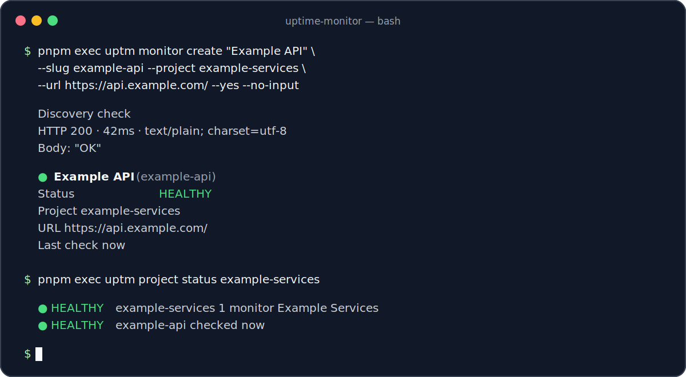
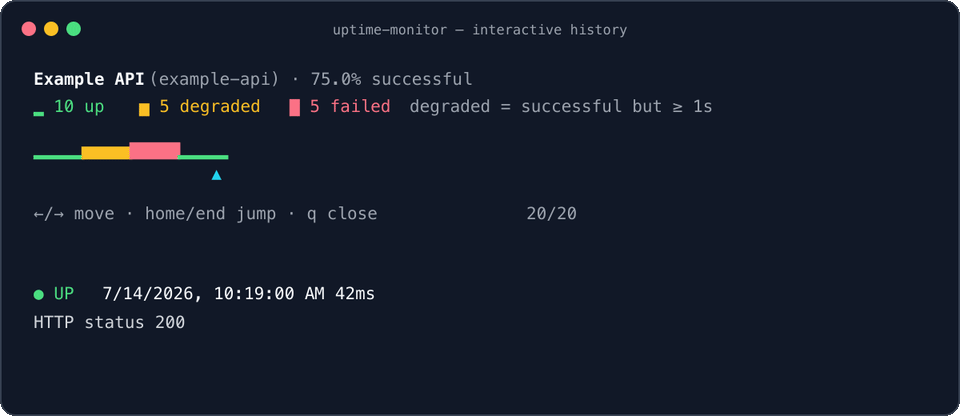

# Uptime Monitor

Monitor the HTTP services you care about from Cloudflare. Each monitor has durable, SQLite-backed state, so it can
confirm outages, remember incidents, recover cleanly, and keep a useful audit trail without a separate database or
always-on server.



<details>
<summary>Watch the interactive history viewer move across status transitions</summary>



</details>

## What you get

- Durable, per-service monitoring with SQLite-backed check and incident history.
- Adaptive cadence: fast confirmation while a service is changing state, quieter checks while it is stable.
- Email and HTTPS webhook alerts that are persisted and idempotent, so retries do not create duplicate notifications.
- Optional projects that roll several monitors up into one health status.
- An interactive CLI history viewer plus long-range timelines that preserve failures and degradations.

## Quick start

### 1. Configure your deployment

You need Cloudflare credentials accepted by Alchemy, Email Routing for the sender domain, and a long random API token.
`UPTIME_ALERT_TO` must be a verified Email Routing destination and `UPTIME_ALERT_FROM` must be allowed by the Worker
email binding. Do not commit the API token.

Install dependencies, then copy `.env.example` to the git-ignored `.env` file and fill in its values:

```sh
pnpm install
cp .env.example .env
```

On macOS, you can keep the API token in Keychain instead of a shell history:

```sh
security add-generic-password -U -a "$USER" -s uptime-monitor-api-token \
  -w "$(openssl rand -hex 32)"
export UPTIME_API_TOKEN="$(security find-generic-password -w -s uptime-monitor-api-token)"
```

Do not print the result of `security find-generic-password`.

### 2. Deploy to Cloudflare

```sh
pnpm plan
pnpm deploy -- --yes
```

The production Worker name is `uptime-monitor`. After deployment, sign in once with the Worker URL printed by Alchemy;
the CLI prompts for the API token without echoing it and saves a private local profile.

```sh
pnpm cli login --url https://uptime-monitor.example.workers.dev
```

### 3. Create your first monitor

Run the guided wizard from this repository:

```sh
pnpm cli monitor create
```

It suggests a URL-safe slug, optionally places the monitor in a project, runs a discovery check, proposes a health
expectation, and can create an alert rule before it writes anything. A fresh check runs immediately after creation.

To set it up without prompts, provide the values explicitly:

```sh
pnpm cli project create "Example Services" --slug example-services
pnpm cli monitor create "Example API" \
  --slug example-api \
  --project example-services \
  --url https://api.example.com/ \
  --yes --no-input
```

### 4. Check what is happening

```sh
pnpm cli monitor list
pnpm cli monitor history example-api --limit 20
pnpm cli project status example-services
```

In a terminal, `history` opens the viewer shown above. Use the arrow keys or Home/End to select a check; press `q`,
Escape, or Enter to close it. Green is healthy, yellow is a successful check that took at least one second, and red is
a failed check.

## How monitoring behaves

By default, requests time out after 10 seconds. Stable healthy and down monitors check every 60 seconds; the first
failure and first recovery are rechecked after 15 seconds. Two checks confirm both downtime and recovery.

- `healthy`: normal checks are succeeding.
- `suspect`: the first failed check has been recorded and is awaiting confirmation.
- `down`: failure is confirmed, an incident is open, and one down notification is scheduled.
- `recovering`: the first successful check after downtime is awaiting confirmation.
- `disabled`: no alarm is scheduled.

Notification actions are recorded before delivery. Email and webhook delivery retry with exponential backoff during
the current invocation, then retry on a later alarm if needed. An action ID includes the incident, transition, and
alert rule, preventing duplicate logical notifications.

## History you can audit

The monitor keeps detail where it matters and gradually compacts routine healthy checks:

- Individual healthy checks: seven days, normally one-minute resolution.
- Five-minute aggregates: through 30 days.
- Fifteen-minute aggregates: through 90 days.
- Hourly aggregates: indefinitely.
- Failed and degraded checks, incidents, and status-duration intervals: indefinitely.

After an upgrade, the first compaction backfills existing checks into each aggregate tier. Timeline buckets include
sample counts, up/degraded/failed counts, and minimum/average/maximum latency.

---

## CLI, HTTP API, and LLM automation

This section is the reference for scripts, agents, and anyone who needs the complete command surface.

### Connection and invocation

Run `uptime login` (or `uptime sign-in`) once to save the Worker origin and API token in
`~/.config/uptime-monitor/config.json`. The profile file is written with owner-only permissions, and `login` verifies
the credentials before saving them. `uptime logout` removes its saved credentials, while `uptime config show` displays
the non-secret settings. CLI commands exclusively use this local profile.

Run it from this repository with `pnpm cli <command>`. The npm package is `uptime-monitor-cli`; after publishing it,
install and run it elsewhere with:

```sh
pnpm add -D uptime-monitor-cli
pnpm exec uptime <command>
```

### CLI reference

Slugs are case-insensitive and can contain only letters, numbers, and dashes. Names are presentation text; the
service generates immutable internal UUIDs that cannot be supplied through the CLI or API. In non-interactive creation,
the discovery suggestion is accepted automatically. Use `--expected-status` and optionally `--expected-body` to
override it; JSON creation output includes the complete discovery result.

Inspect monitors and history:

```sh
pnpm cli monitor list
pnpm cli monitor list --project example-services
pnpm cli monitor get example-api
pnpm cli monitor history example-api --limit 20
pnpm cli monitor timeline example-api --since 30d
```

`list` prints one compact line per monitor. Piped history output is automatically non-interactive and prints checks
newest first. Use `--verbose` to include response bodies and errors, or `--no-interactive` to print history once:

```sh
pnpm cli --verbose monitor get example-api
pnpm cli --verbose monitor history example-api --no-interactive
```

Run a check, edit selected fields, disable a monitor without losing history, or rename its canonical slug:

```sh
pnpm cli monitor check example-api
pnpm cli monitor edit example-api --disable
pnpm cli monitor edit example-api --project example-services
pnpm cli monitor edit example-api --no-project
pnpm cli monitor edit example-api --enable
pnpm cli monitor rename old-name new-name --project example-services
```

Renaming does not move the Durable Object, so checks, incidents, and alerts stay intact; the old slug stops resolving.
Projects are optional roll-up views, not owners of monitor state:

```sh
pnpm cli project list
pnpm cli project status example-services
```

A project is `down` if any active monitor is down, `degraded` if any monitor is suspect or recovering, `unknown` when
empty or uninitialized, and otherwise `healthy`. Disabled monitors do not lower project health.

Manage alert rules with a stable alert ID:

```sh
pnpm cli monitor example-api alerts list
pnpm cli monitor example-api alerts create
pnpm cli monitor example-api alerts remove primary-email
```

Alert creation prompts for the type, destination, events, and confirmation. Email destinations must be verified
Cloudflare Email Routing destinations. Webhook URLs must use HTTPS and are masked in later CLI and API output. Generic
webhooks support services such as Slack, Discord, and Teams; provider-specific messaging is not configured.

Monitor and history listings default to 50 items and accept `--limit` up to 500. When another page exists, human
output prints the next `--cursor`; JSON includes `page.hasMore` and `page.nextCursor`.

### Structured output and LLM playbook

`--verbose` and `--json` are global options and work before or after the command name. Use `--json` for stable,
context-rich output; it disables colours and interactive output. With pnpm, add `--silent` so stdout is exactly one
JSON document. A non-zero exit means the request, authentication, or response decoding failed.

```sh
pnpm --silent cli monitor list --json --no-input
pnpm --silent cli monitor history example-api --limit 100 --json --no-input
pnpm --silent cli monitor timeline example-api --since 90d --json --no-input
pnpm --silent cli project status example-services --json --no-input
```

Agents should use the CLI instead of constructing Worker API calls manually:

1. Run `uptime config show` to confirm saved credentials.
2. Invoke the package with `pnpm --silent` and the global `--json` option.
3. Inspect with `monitor list --json` or `monitor get <slug> --json` before making a change.
4. Treat `schemaVersion` as the output contract version and `generatedAt` as the observation time.
5. Recent history JSON includes complete configuration and current state, aggregate counts, ordering semantics, and all
   returned checks. Use `--limit 500` for maximum recent context; use `monitor timeline <slug> --since <duration>` for
   long-range analysis, bucket resolution, intervals, and retained anomalies.
6. Preserve the existing URL, expected response, and cadence unless the task explicitly changes them.
7. Use `monitor create` for creation and `monitor edit` for partial updates. Add `--yes --no-input` to every mutation
   so it cannot prompt or wait indefinitely.
8. Create alerts non-interactively with all required fields, for example:
   `monitor example-api alerts create primary --type email --destination alerts@example.com --events down,recovered --yes --no-input --json`.
9. After an update, run `monitor check <slug>`, then inspect `monitor get` and `monitor history`.
10. Follow `page.nextCursor` until `page.hasMore` is false when full traversal matters.
11. Use the canonical slug in `monitor.config.slug`; renamed slugs stop resolving immediately.
12. Use `project status <slug>` to obtain the current roll-up and every member monitor in one request.
13. Never pass secrets in monitor URLs or expected response bodies. Treat webhook destinations as secrets even though
    returned values are masked.

### HTTP API

Every monitor and project endpoint requires the API bearer token. The public endpoints are `/health` and
`/openapi.json`; they expose no monitor state. Use the Worker URL shown by `uptime config show` followed by
`/openapi.json` as the live HTTP API schema.
